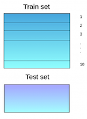
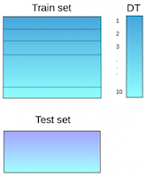
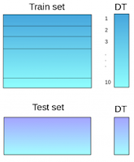
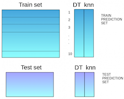
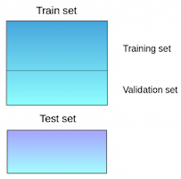
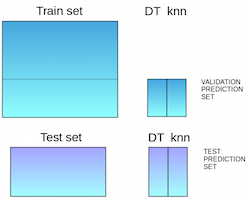
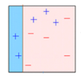
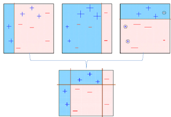

Ensemble Models
=============================

Ensemble models is a machine learning approach to combine multiple other models
in the prediction process. Those models are referred to as base estimators. It
is a solution to overcome the following technical challenges of building a
single estimator:

- High variance: The model is very sensitive to the provided inputs to the
  learned features.
- Low accuracy: One model or one algorithm to fit the entire training data might
  not be good enough to meet expectations.
- Features noise and bias: The model relies heavily on one or a few features
  while making a prediction.

<b style="font-size:18px">Ensemble Algorithms</b>

A single algorithm may not make the perfect prediction for a given dataset.
Machine learning algorithms have their limitations and producing a model with
high accuracy is challenging.

If we build and combine multiple models, the overall accuracy could get boosted.
The combination can be implemented by aggregating the output from each model
with two objectives: reducing the model error and maintaining its
generalization.

The way to implement such aggregation can be achieved using some techniques.
Some textbooks refer to such architecture as **meta-algorithms**.

  
  
Diversifying the model predictions using multiple algorithms.

<b style="font-size:18px">Ensemble Learning</b>

Ensemble learning is a combination of several machine learning models in one
problem. These models are known as **weak learners**. The intuition is that when
you combine several weak learners, they can become **strong learners**.

Each weak learner is fitted on the training set and provides predictions
obtained. The final prediction result is computed by combining the results from
all the weak learners.

One important aspect to mention is those weak learners can have different ways
of mapping the features with variant decision boundaries.

  
  
Aggregated predictions using multiple weak learners of the same algorithm.

## Basic Ensemble Techniques

<b style="font-size:18px">Max Voting</b>

The max voting method is generally used for classification problems. In this
technique, multiple models are used to make predictions for each data point. The
predictions by each model are considered as a `vote`. The predictions which we
get from the majority of the models are used as the final prediction.

For example, when you asked 5 of your colleagues to rate your movie (out of 5);
we’ll assume three of them rated it as 4 while two of them gave it a 5. Since
the majority gave a rating of 4, the final rating will be taken as 4. You can
consider this as taking the mode of all the predictions. The result of max
voting would be something like this:

| Colleague 1 | Colleague 2 | Colleague 3 | Colleague 4 | Colleague 5 | Final Rating |
|:-----------:|:-----------:|:-----------:|:-----------:|:-----------:|:------------:|
|      5      |      4      |      5      |      4      |      4      |    **4**     |
 

<b style="font-size:18px">Averaging</b>

In this method, we take an average of predictions from all the models and use it
to make the final prediction. Averaging can be used for making predictions in
regression problems or while calculating probabilities for classification
problems.

For example, the averaging method would take the average of all the values.
i.e. (5+4+5+4+4)/5 = 4.4

| Colleague 1 | Colleague 2 | Colleague 3 | Colleague 4 | Colleague 5 | Final Rating |
|:-----------:|:-----------:|:-----------:|:-----------:|:-----------:|:------------:|
|      5      |      4      |      5      |      4      |      4      |   **4.4**    |

<b style="font-size:18px">Weighted Average</b>

All models are assigned different weights defining the importance of each model
for prediction. For instance, if two of your colleagues are critics, while
others have no prior experience in this field, then the answers by these two
friends are given more importance as compared to the other people.

The result is calculated as [(5*0.23) + (4*0.23) + (5*0.18) + (
4*0.18) + (4*0.18)] = 4.41:

|        | Colleague 1 | Colleague 2 | Colleague 3 | Colleague 4 | Colleague 5 | Final Rating |
|:-------|:-----------:|:-----------:|:-----------:|:-----------:|:-----------:|:------------:|
| weight |    0.23     |    0.23     |    0.18     |    0.18     |    0.18     |              |
| rating |      5      |      4      |      5      |      4      |      4      |   **4.41**   |

## Advanced Ensemble Techniques

<b style="font-size:18px">Stacking</b>

Stacking is a learning technique that uses predictions from multiple models (for
example decision tree, knn or svm) to build a new model. This model is used for
making predictions on the test set.

Below is a step-wise explanation for a simple stacked ensemble

| Step                                                                                                                                                              |                                      | 
|:------------------------------------------------------------------------------------------------------------------------------------------------------------------|:-------------------------------------|
| 1. The train set is split into 10 parts                                                                                                                           |  |
| 2. A base model (suppose a decision tree) is fitted on 9 parts and predictions   are made for the 10th part. This is done for each part of the train set.      |  |
| 3. The base model (in this case, decision tree) is then fitted on the whole train dataset.   4. Using this model, predictions are made on the test set.        |  |
| 5. Steps 2 to 4 are repeated for another base model (say knn) resulting in another   set of predictions for the train set and test set.                        |  |
| 6. The predictions from the train set are used as features to build a new model.   7. This model is used to make final predictions on the test prediction set. |  |

<b style="font-size:18px">Blending</b>

Blending follows the same approach as **stacking** but uses only a holdout (
validation) set from the train set to make predictions. In other words, unlike
stacking, the predictions are made on the holdout set only. The holdout set and
the predictions are used to build a model which is run on the test set.

Here is a detailed explanation of the blending process:

| Step                                                                                                                                                                     |                                      | 
|:-------------------------------------------------------------------------------------------------------------------------------------------------------------------------|:-------------------------------------|
| 1. The train set is split into training and validation sets.                                                                                                             |  |
| 2. Model(s) are fitted on the training set.   3. The predictions are made on the validation set and the test set.                                                     |  |
| 4. The validation set and its predictions are used as features to build a new model.   5. This model is used to make final predictions on the test and meta-features. |                                      |

<b style="font-size:18px">Bagging</b>

The idea behind bagging is combining the results of multiple models (for
instance, all decision trees) to get a generalized result. Here’s a question: If
you create all the models on the same set of data and combine it, will it be
useful? There is a high chance that these models will give the same result since
they are getting the same input. So how can we solve this problem? One of the
techniques is bootstrapping.

**Bootstrapping** is a sampling technique in which we create subsets of
observations from the original dataset, with replacement. The size of the
subsets is the same as the size of the original set.

  
  
Boostrapping

**Bagging** (or Bootstrap Aggregating) technique uses these subsets (bags) to
get a fair idea of the distribution (complete set). The size of subsets created
for bagging may be less than the original set.

1. Multiple subsets are created from the original dataset, selecting
   observations with replacement.
2. A base model (weak model) is created on each of these subsets.
3. The models run in parallel and are independent of each other.
4. The final predictions are determined by combining the predictions from all
   the models.

  
  
Bagging

<b style="font-size:18px">Boosting</b>

Before we go further, here’s another question for you: If a data point is
incorrectly predicted by the first model, and then the next (probably all
models), will combining the predictions provide better results? Such situations
are taken care of by boosting.

**Boosting** is a sequential process, where each subsequent model attempts to
correct the errors of the previous model. The succeeding models are dependent on
the previous model. 

> Thus, the boosting algorithm combines a number of weak learners to form a
> strong learner. The individual models would not perform well on the entire
> dataset, but they work well for some part of the dataset. Thus, each model
> actually boosts the performance of the ensemble.

Let’s understand the way boosting works in the below steps:

| Step                                                                                                                                                                                                                                                                                                                                                                                         |                                      | 
|:---------------------------------------------------------------------------------------------------------------------------------------------------------------------------------------------------------------------------------------------------------------------------------------------------------------------------------------------------------------------------------------------|:-------------------------------------|
| 1. A subset is created from the original dataset.   2. Initially, all data points are given equal weights.   3. A base model is created on this subset.   4. This model is used to make predictions on the whole dataset                                                                                                                                                            |  |
| 5. Errors are calculated using the actual values and predicted values.   6. The observations which are incorrectly predicted, are given higher weights.   (Here, the three misclassified blue-plus points will be given higher weights)   7. Another model is created and predictions are made on the dataset   (This model tries to correct the errors from the previous model) |  |
| 8. Similarly, multiple models are created, each correcting the errors of the previous model.   9. The final model (strong learner) is the weighted mean of all the models (weak learners).                                                                                                                                                                                                |  |

